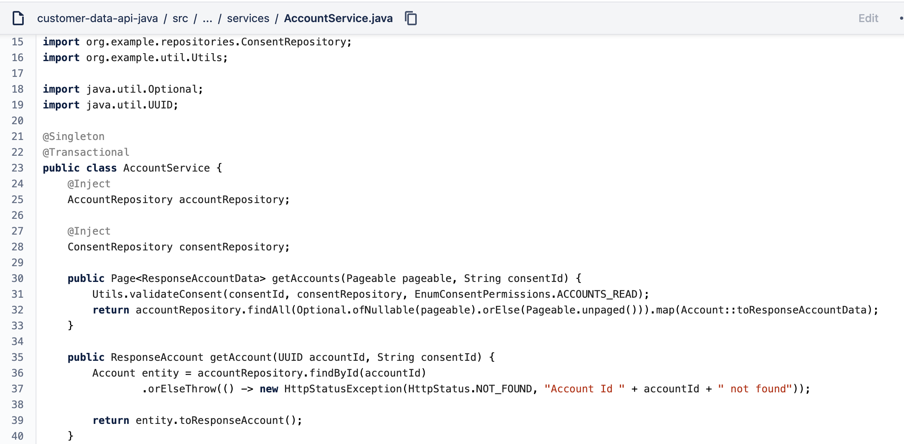

# Bug Report: #01

Dead code in AccountService class

## Details

### Steps to reproduce

1. Open [AccountService](https://bitbucket.org/thiagohcn/customer-data-api-java/src/master/src/main/java/org/example/services/AccountService.java) class code.

### Expected result
There is no dead code in the class.

### Observed result
The consentId is not used by the `getAccount` method.

## Priorization

### Priority
`Low`

### Reason
Does not affect endpoint behavior.